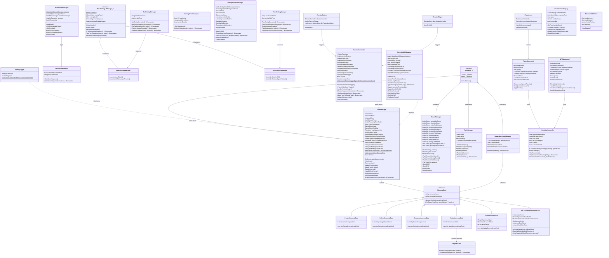

```mermaid
classDiagram
    %% [1] Core & Base Systems
    class Singleton_T {
        <<Abstract>>
        -static T _instance
        +static T instance$
        #virtual Awake()
    }
    
    class AbnormalData {
        <<Abstract>>
        +string abnormalName
        +string abnormalDescription
        +abstract ApplyAbnormal(mapRoot)
        #FindTarget(mapRoot, targetName) Transform
    }

    class BaseEndingUIManager_T {
        <<Abstract>>
        +static T instance$
        #GameObject endingPanel
        #Text endingTextUI
        #List~string~ monologueList
        -float monologueDisplayDuration
        #virtual Awake()
        #virtual Start()
        #abstract AutoBindUI()
        +PlayMonologueSequence() IEnumerator
        -TypeTextCoroutine(content, speed) IEnumerator
        #abstract OnMonologueFinished()
    }

    %% [2] Global Managers (Singleton Inheritance)
    Singleton_T <|-- GameManager : Inheritance
    Singleton_T <|-- SoundManager : Inheritance
    Singleton_T <|-- FadeManager : Inheritance
    Singleton_T <|-- SpawnAbnormalManager : Inheritance

    class GameManager {
        -int startFloor
        -int currentFloor
        -int targetFloor
        -bool[] visitedFloors
        -bool isReturningFromFailure
        +bool showFloorNumber
        -GameObject map
        -GameObject finalMap
        -Transform mapSpawnPoint
        +GameObject player
        -Vector3 playerSpawnPosition
        -Quaternion playerSpawnRotation
        -GameObject currentMapInstance
        -AbnormalData currentAbnormalData
        -string currentSceneName
        -string mainMenuSceneName
        -string badEndingSceneName
        -string trueEndingSceneName
        +static event Action~int~ OnFloorFirstVisited$
        +static event Action OnLoopReset$
        +bool isEnded
        -OnSceneLoaded(scene, mode)
        +StartLoop()
        -GenerateMap()
        -UpdateFloorDisplay()
        -ResetPlayerPosition()
        -ResetAbnormal()
        -HandleFloorEvents()
        +CheckAnswer(choice)
        +ProcessEnding(type)
        -EndingSequenceCoroutine(type) IEnumerator
    }

    class SoundManager {
        -AudioSource bgmAudioSource
        -AudioSource sfxAudioSource
        -AudioSource voiceAudioSource
        -AudioClip elevatorButtonSound
        -AudioClip elevatorDoorSound
        -AudioClip elevatorMovingSound
        -AudioClip elevatorFinishSound
        -AudioClip badEndingBGM
        -AudioClip eyeOpeningBGM
        -AudioClip trueEndingBGM
        -AudioClip endingCreditBGM
        -List~AudioClip~ monologueAudioList
        -List~AudioClip~ loopResetAudioList
        +PlayBGM(clip, volume)
        +PlaySFX(clip, volume)
        +PlayButtonSound()
        +PlayElevatorDoorSound()
        +PlayElevatorMovingSound()
        +PlayElevatorFinishSound()
        +PlayVoice(clip, volume)
        +StopBGM()
        +StopSFX()
        +StopVoice()
        +StopAllSound()
    }

    class FadeManager {
        -Image black
        -Image white
        +bool isFading
        -Coroutine currentFadeCoroutine
        -AutoBindImages()
        +SetAllBackground(state)
        +FadeOut(duration)
        +FadeIn(duration)
        +FlashOut(duration)
        +FlashIn(duration)
        -FadeCoroutine(...) IEnumerator
    }

    class SpawnAbnormalManager {
        -List~AbnormalData~ abnormalDatas
        -float AbnormalRate
        +GameObject mapRoot
        +AbnormalData currentAbnormal
        +SelectAbnormal() AbnormalData
    }

    %% [3] Scene & Sequence Managers
    class BadEndingManager {
        -string nextSceneName
        -float transferTime
        -BadEndingCoroutine() IEnumerator
        -BadEndingSequenceCoroutine() IEnumerator
        -PlayFadeAndAudioCoroutine() IEnumerator
        -PlayMonologueCoroutine() IEnumerator
        -TransitionToNextSceneCoroutine() IEnumerator
    }

    class TrueEndingManager {
        -string nextSceneName
        -float endingWaitTime
        -TrueEndingCoroutine() IEnumerator
        -TrueEndingSequenceCoroutine() IEnumerator
        -SetMonologueSequence()
        -PlayMonologueCoroutine() IEnumerator
        -TransitionToNextSceneCoroutine() IEnumerator
    }

    class EndingCreditManager {
        -bool isTransitioning
        -string mainMenuScene
        -float transferDuration
        +GoToMainMenu()
        -ReturnToMainMenuCoroutine() IEnumerator
    }

    class MainMenuManager {
        -ElevatorRideEffect rideEffect
        -string nextSceneName
        +StartGameSequence()
        +StartGameSequenceCoroutine() IEnumerator
    }

    %% [4] UI & Presentation
    BaseEndingUIManager_T <|-- BadEndingUIManager : Inheritance
    BaseEndingUIManager_T <|-- TrueEndingUIManager : Inheritance

    class BadEndingUIManager {
        #override AutoBindUI()
        #override OnMonologueFinished()
    }

    class TrueEndingUIManager {
        #override AutoBindUI()
        #override OnMonologueFinished()
    }

    class EndingCreditUIManager {
        +static EndingCreditUIManager instance$
        -GameObject blackBackgroundPanel
        -Text roleText
        -Text nameText
        -Button skipButton
        -List~string~ roleTextList
        -List~string~ nameTextList
        -float fadeDuration
        -float displayDuration
        -Coroutine creditCoroutine
        -bool isSkipped
        -AutoBindUI()
        -CreditSequenceCoroutine() IEnumerator
        -FadeTextAlpha(start, target, duration) IEnumerator
        +OnClickSkipButton()
        -FinishCredits()
    }

    class MainMenuUIManager {
        +static MainMenuUIManager instance$
        -GameObject descriptionPanel
        -MainMenuManager mainMenuManager
        -GraphicRaycaster raycaster
        -bool isProcessing
        -AutoBindUI()
        +SetUIInteractable(state)
        +OnClickStart()
        +OnClickDescription()
        +OnClickCloseDescription()
        +OnClickExit()
    }

    class StoryModeUIManager {
        +static StoryModeUIManager instance$
        -Text elevatorText
        -GameObject menuUI
        -bool menuActivated
        -Text monologueText
        -List~string~ monologueList
        -List~string~ loopResetList
        -Coroutine currentMonologueCoroutine
        -PlayerMovement playerMovement
        -AutoBindUI()
        -HandleFloorFirstVisited(floor)
        -HandleLoopReset()
        -ShowMonologue(content, clip)
        -TypeMonologue(content, clip) IEnumerator
        -ToggleInteractionText(isVisible)
        -ToggleMenu(isVisible)
        +OnClickContinue()
        +OnClickGoToTitle()
        +OnClickExit()
        -PlayButtonSound()
    }

    %% [5] Anomaly System (ScriptableObjects)
    AbnormalData <|-- CreateAbnormalData
    AbnormalData <|-- DeleteAbnormalData
    AbnormalData <|-- ReplaceAbnormalData
    AbnormalData <|-- ScaleAbnormalData
    AbnormalData <|-- SoundAbnormalData
    AbnormalData <|-- NPCTransformAbnormalData

    class CreateAbnormalData {
        +List~SpawnInfo~ spawnList
        +override ApplyAbnormal(mapRoot)
    }

    class DeleteAbnormalData {
        +List~string~ targetObjectNames
        +override ApplyAbnormal(mapRoot)
    }

    class ReplaceAbnormalData {
        +List~ReplaceInfo~ replaceList
        +override ApplyAbnormal(mapRoot)
    }

    class ScaleAbnormalData {
        +List~ScaleInfo~ scaleList
        +override ApplyAbnormal(mapRoot)
    }

    class SoundAbnormalData {
        +TargetType targetType
        +SoundMode soundMode
        +string targetName
        +override ApplyAbnormal(mapRoot)
    }

    class NPCTransformAbnormalData {
        +string targetName
        +GameObject newModelPrefab
        +RuntimeAnimatorController newController
        +Avatar newAvatar
        +string rootBoneName
        +string defaultAnimState
        +override ApplyAbnormal(mapRoot)
        -CleanUpOldModel(bodyTransform)
        -SetupNewModel(bodyTransform, animator)
    }

    %% [6] Player & NPC System
    class PlayerInput {
        -float mouseSensitivity
        -PlayerMovement playerMovement
        -HandleMovementInput()
        -HandleLookInput()
    }

    class PlayerMovement {
        +float walkSpeed
        +float runSpeed
        -float gravity
        -CharacterController characterController
        -FootstepController footstepController
        +bool canMove
        -Transform cameraPivot
        -float verticalLookRotation
        +Move(moveInput, isRunning)
        +Look(mouseX, mouseY)
        -ApplyGravity()
    }

    class NPCMovement {
        -float walkSpeed
        -Transform[] waypoints
        -FootstepController footstepController
        -NavMeshAgent navMeshAgent
        -int currentWaypoint
        -Animator animator
        +bool opening
        -bool isMuted
        -bool isDoubleSound
        -CheckWayPointArrival()
        -HandleFootsteps()
        +SetAbnormalStatus(mute, doubleSound)
        +LookAtTarget(targetPos)
    }

    class FootstepController {
        -float defaultWalkDuration
        -AudioClip walkSound
        -float walkTimer
        +bool isForceStopped
        -bool isMuted
        -bool isDoubleSound
        +CalculateAndPlayFootstep(isMoving, speedRatio)
        +StopFootsteps()
        -PlaySoundLogic()
        -PlayDoubleSoundRoutine(delay) IEnumerator
        +SetAbnormalStatus(mute, doubleSound)
    }

    %% [7] Environment & Interaction
    class ElevatorController {
        +TriggerType type
        -float detectionDistance
        -float transferDelay
        -float doorAnimDuration
        -Animator animator
        -Animator parentAnimator
        -Transform playerTransform
        -PlayerMovement playerMovement
        -bool isAnimating
        -bool isSequenceRunning
        -bool ignoreFirstTrigger
        +bool isOpen
        -Transform standPoint
        +static event Action~TriggerType~ OnElevatorAnswerSelected$
        +PlayerEnteredInnerTrigger()
        +PlayerExitedInnerTrigger()
        -HandleProximityLogic()
        -ElevatorSequenceCoroutine() IEnumerator
        +SetDoors(shouldOpen) IEnumerator
        -MovePlayerToStandPoint() IEnumerator
        -UpdateAnimators(state)
        -PlayDoorSound()
    }

    class ElevatorButton {
        -ElevatorController elevatorController
        -bool isPlayerInTrigger
        +static event Action~bool~ OnPlayerNearButton$
        -AutoBindUI()
    }

    class ElevatorTrigger {
        -ElevatorController elevatorController
        -AutoBindUI()
    }

    class EndingTrigger {
        -EndType endType
        -bool isTriggered
        +static event Action~EndType~ OnEndingTriggered$
    }

    class FloorNumberDisplay {
        -GameObject[] numberPrefabs
        -List~GameObject~ numberPool
        -float space
        -Vector3 numberScale
        -bool centerAlign
        +SetFloorNumber(floor)
        -GetDigits(number) List~int~
        -PreparePool(requiredCount)
        -UpdateNumberObject(index, digit)
        +ResetFloorNumber()
    }

    class ElevatorRideEffect {
        -float shakeAmount
        -float shakeSpeed
        -Vector3 initialPosition
        -bool isMoving
        +StopElevator()
    }

    class ObjectScaler {
        +StartScaling(targetScale, duration)
        -ScaleRoutine(targetScale, duration) IEnumerator
    }

    %% [8] Key Relationships & Dependencies
    GameManager o-- AbnormalData : current
    SpawnAbnormalManager o-- AbnormalData : collection
    PlayerMovement --> FootstepController : uses
    NPCMovement --> FootstepController : uses
    PlayerInput --> PlayerMovement : controls
    ElevatorButton --> ElevatorController : triggers
    ElevatorTrigger --> ElevatorController : triggers
    EndingTrigger ..> GameManager : event-driven
    ElevatorController ..> GameManager : event-driven
    ScaleAbnormalData ..> ObjectScaler : dynamic injection
    BadEndingManager --> BadEndingUIManager : sequence
    TrueEndingManager --> TrueEndingUIManager : sequence
    MainMenuUIManager --> MainMenuManager : logic
    StoryModeUIManager ..> GameManager : observer
```
