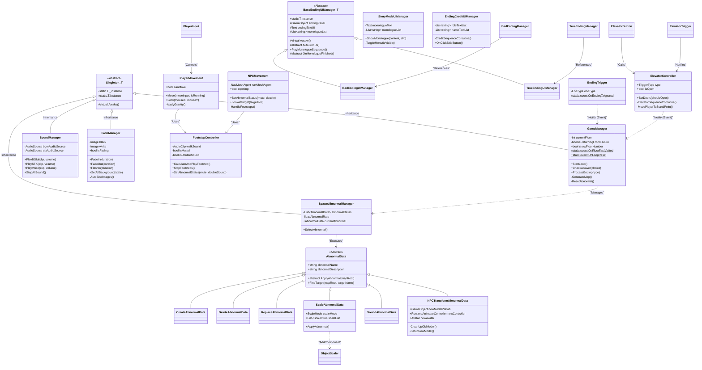

```mermaid
classDiagram
    %% [1] Core Framework & Base Classes
    class Singleton_T {
        <<Abstract>>
        -static T _instance
        +static T instance$
        #virtual Awake()
    }
    
    class AbnormalData {
        <<Abstract>>
        +string abnormalName
        +string abnormalDescription
        +abstract ApplyAbnormal(mapRoot)
        #FindTarget(mapRoot, targetName)
    }

    class BaseEndingUIManager_T {
        <<Abstract>>
        +static T instance$
        #GameObject endingPanel
        #Text endingTextUI
        #List~string~ monologueList
        #virtual Awake()
        #abstract AutoBindUI()
        +PlayMonologueSequence()
        #abstract OnMonologueFinished()
    }

    %% [2] Global Manager System (Inherit Singleton)
    Singleton_T <|-- GameManager : Inheritance
    Singleton_T <|-- SoundManager : Inheritance
    Singleton_T <|-- FadeManager : Inheritance
    Singleton_T <|-- SpawnAbnormalManager : Inheritance

    class GameManager {
        -int currentFloor
        -bool isReturningFromFailure
        +bool showFloorNumber
        +static event OnFloorFirstVisited$
        +static event OnLoopReset$
        +StartLoop()
        +CheckAnswer(choice)
        +ProcessEnding(type)
        -GenerateMap()
        -ResetAbnormal()
    }

    class SoundManager {
        -AudioSource bgmAudioSource
        -AudioSource sfxAudioSource
        +PlayBGM(clip, volume)
        +PlaySFX(clip, volume)
        +PlayVoice(clip, volume)
        +StopAllSound()
    }

    class FadeManager {
        -Image black
        -Image white
        +bool isFading
        +FadeIn(duration)
        +FadeOut(duration)
        +FlashIn(duration)
        +SetAllBackground(state)
        -AutoBindImages()
    }

    class SpawnAbnormalManager {
        -List~AbnormalData~ abnormalDatas
        -float AbnormalRate
        +AbnormalData currentAbnormal
        +SelectAbnormal()
    }

    %% [3] Anomaly System (Inherit AbnormalData)
    AbnormalData <|-- CreateAbnormalData
    AbnormalData <|-- DeleteAbnormalData
    AbnormalData <|-- ReplaceAbnormalData
    AbnormalData <|-- ScaleAbnormalData
    AbnormalData <|-- SoundAbnormalData
    AbnormalData <|-- NPCTransformAbnormalData

    class NPCTransformAbnormalData {
        +GameObject newModelPrefab
        +RuntimeAnimatorController newController
        +Avatar newAvatar
        -CleanUpOldModel()
        -SetupNewModel()
    }

    class ScaleAbnormalData {
        +ScaleMode scaleMode
        +List~ScaleInfo~ scaleList
        +ApplyAbnormal()
    }

    %% [4] Actor & Movement System
    class PlayerMovement {
        +bool canMove
        +Move(moveInput, isRunning)
        +Look(mouseX, mouseY)
        -ApplyGravity()
    }

    class NPCMovement {
        -NavMeshAgent navMeshAgent
        +bool opening
        +SetAbnormalStatus(mute, double)
        +LookAtTarget(targetPos)
        -HandleFootsteps()
    }

    class FootstepController {
        -AudioClip walkSound
        -bool isMuted
        -bool isDoubleSound
        +CalculateAndPlayFootstep()
        +StopFootsteps()
        +SetAbnormalStatus(mute, doubleSound)
    }

    PlayerMovement --> FootstepController : "Uses"
    NPCMovement --> FootstepController : "Uses"
    PlayerInput --> PlayerMovement : "Controls"

    %% [5] UI & Presentation System
    BaseEndingUIManager_T <|-- BadEndingUIManager
    BaseEndingUIManager_T <|-- TrueEndingUIManager
    
    class StoryModeUIManager {
        -Text monologueText
        -List~string~ monologueList
        +ShowMonologue(content, clip)
        -ToggleMenu(isVisible)
    }

    class EndingCreditUIManager {
        -List~string~ roleTextList
        -List~string~ nameTextList
        -CreditSequenceCoroutine()
        +OnClickSkipButton()
    }

    %% [6] Environment & Interaction
    class ElevatorController {
        +TriggerType type
        +bool isOpen
        +SetDoors(shouldOpen)
        -ElevatorSequenceCoroutine()
        -MovePlayerToStandPoint()
    }

    class EndingTrigger {
        -EndType endType
        +static event OnEndingTriggered$
    }

    %% [7] Key Relationships & Events
    GameManager ..> SpawnAbnormalManager : "Manages"
    SpawnAbnormalManager ..> AbnormalData : "Executes"
    EndingTrigger ..> GameManager : "Notify (Event)"
    ElevatorController ..> GameManager : "Notify (Event)"
    ScaleAbnormalData ..> ObjectScaler : "AddComponent"
    BadEndingManager --> BadEndingUIManager : "References"
    TrueEndingManager --> TrueEndingUIManager : "References"
    ElevatorButton --> ElevatorController : "Calls"
    ElevatorTrigger --> ElevatorController : "Notifies"
```
