# 📐 클래스 다이어그램 — 지하 10층 (Basement_10)

> 실제 구현 코드(`Scripts/`) 기준 구조도입니다.
> 가독성을 위해 **시스템별로 다이어그램을 분리**했으며, 각 다이어그램에는 핵심 멤버만 표기했습니다.

**설계의 세 가지 축**

1. **God-class 분리** — `GameManager`의 책임을 순수 로직(POCO/static)과 Unity 협력자(MonoBehaviour)로 분해 → 단위 테스트 가능
2. **추상화 기반 확장** — `AbnormalData` / `SettingApplierBase` / `BaseUIManager<T>` 상속으로 기존 코드 수정 없이 기능 추가(OCP)
3. **정적 이벤트 기반 느슨한 결합** — 시스템 간 직접 참조 최소화

### 📑 목차

| # | 다이어그램 | 내용 |
|---|---|---|
| 0 | [전체 구조 개요](#0-전체-구조-개요) | 시스템 간 의존 관계 맵 |
| 1 | [Core 공통 기반](#1-core-공통-기반) | `Singleton<T>` · `BaseUIManager<T>` · `UIBinder` |
| 2 | [게임 코어](#2-게임-코어--god-class-분리) | `GameManager` 책임 분해 & 단위 테스트 |
| 3 | [이상현상 시스템](#3-이상현상-시스템-다형성) | `AbnormalData` 계층 |
| 4 | [설정 시스템](#4-설정-시스템-observer) | `SettingManager` & 적용기 계층 |
| 5 | [로컬라이제이션](#5-로컬라이제이션) | `Loc` · 4개 언어 |
| 6 | [캐릭터 & 엘리베이터](#6-캐릭터--엘리베이터) | 이동 · 발소리 · 상호작용 |
| 7 | [UI 계층](#7-ui-계층) | UI 매니저 & 연출 컴포넌트 |
| 8 | [사운드 · 연출 · 씬 시퀀스](#8-사운드--연출--씬-시퀀스) | `SoundManager` · `FadeManager` · 엔딩 |
| 9 | [이벤트 흐름](#9-이벤트-흐름-정적-이벤트) | 정적 이벤트 발행/구독 관계 |

---

## 0. 전체 구조 개요

세부 클래스는 생략하고 **시스템 단위의 의존 방향**만 표현했습니다.

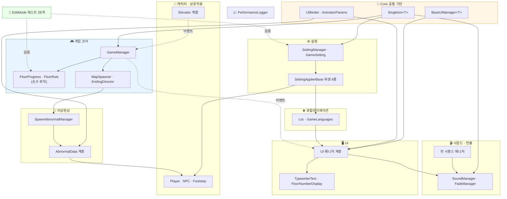

---

## 1. Core 공통 기반

프로젝트 전반에서 재사용되는 기반 계층입니다. 싱글톤·UI 바인딩·문자열 해시 캐싱의 중복 로직을 제거합니다.

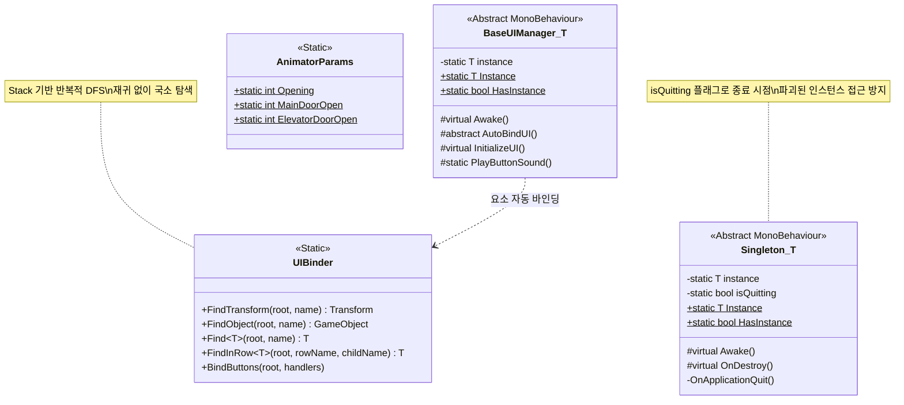

---

## 2. 게임 코어 — God-class 분리

핵심 게임 루프를 담당하던 `GameManager`를 **역할별로 분해**했습니다.
`FloorProgress`·`FloorRule`은 `MonoBehaviour`가 아닌 **순수 C# 로직**이라 Unity 런타임 없이 테스트할 수 있습니다.

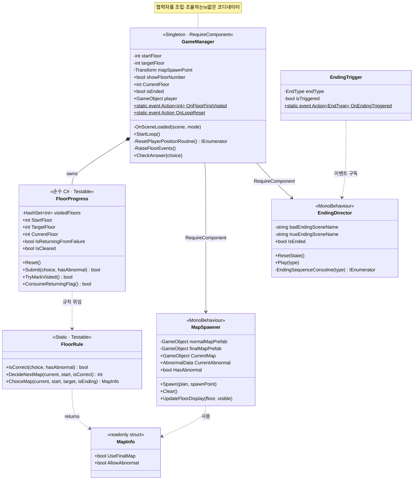

### 순수 로직 분리로 확보한 단위 테스트 (총 28개)

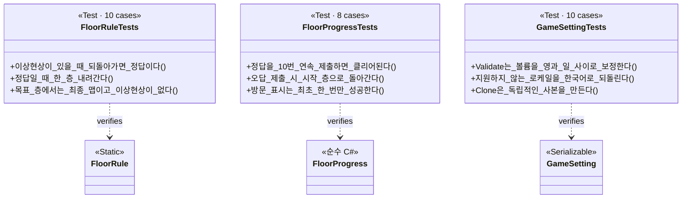

---

## 3. 이상현상 시스템 (다형성)

추상 클래스 `AbnormalData`(ScriptableObject) 하나로 6종의 이상현상을 확장합니다.
새 이상현상 추가 시 **기존 시스템 코드 수정이 불필요**합니다(OCP).

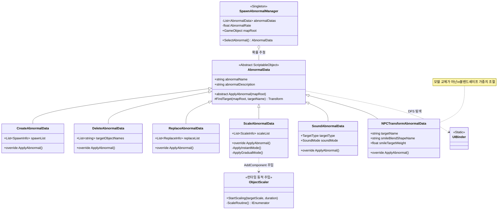

---

## 4. 설정 시스템 (Observer)

`SettingManager`가 설정 변경을 이벤트로 브로드캐스트하면, 각 적용기가 **자신에게 필요한 항목만 독립적으로 구독·적용**합니다.

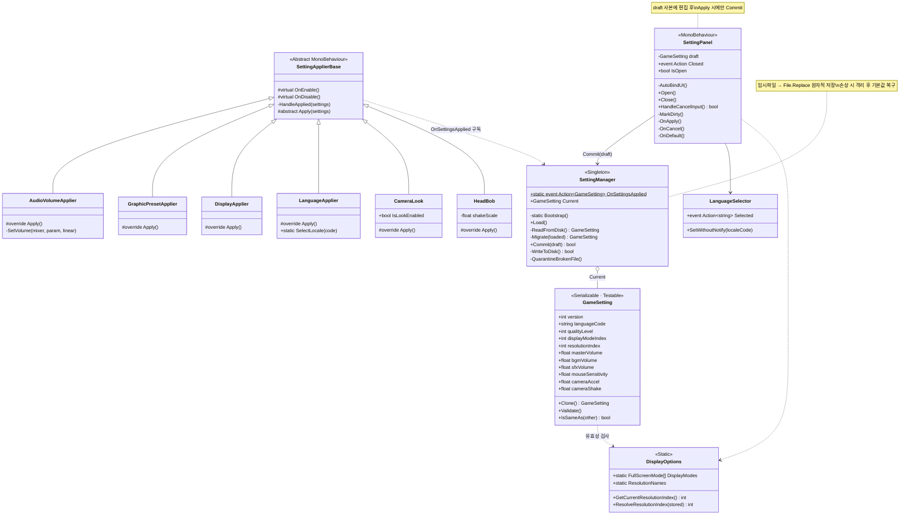

---

## 5. 로컬라이제이션

한국어 · 영어 · 일본어 · 중국어(간체) 4개 언어를 지원하며, 번역 누락 시 **폴백 체인**으로 빈 화면을 방지합니다.

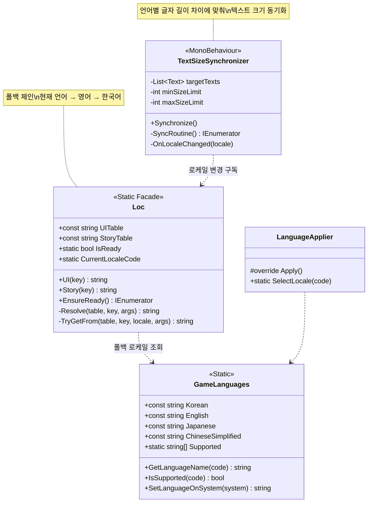

---

## 6. 캐릭터 & 엘리베이터

입력·이동·발소리를 컴포넌트로 분리하고, 엘리베이터는 **정적 이벤트로 정답 선택을 발행**합니다.

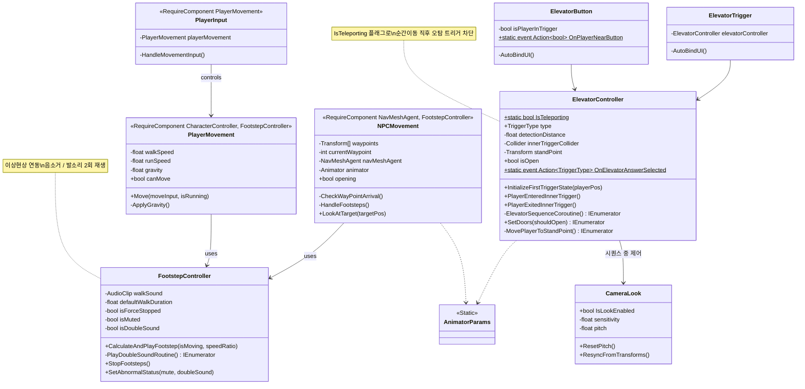

---

## 7. UI 계층

`BaseUIManager<T>`가 싱글톤·자동 바인딩·초기화를 공통 처리하고, 엔딩 UI는 한 단계 더 추상화했습니다.

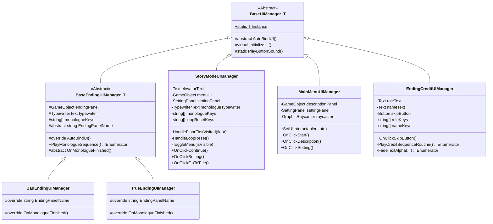

### UI 연출 컴포넌트

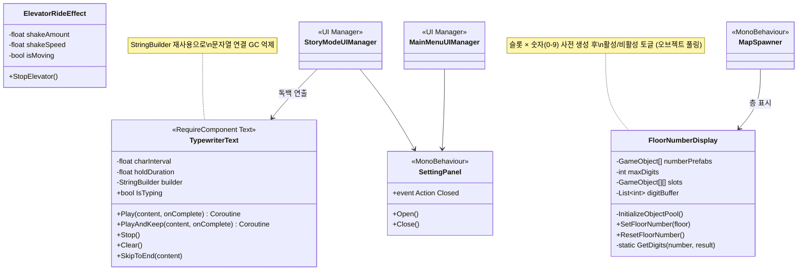

---

## 8. 사운드 · 연출 · 씬 시퀀스

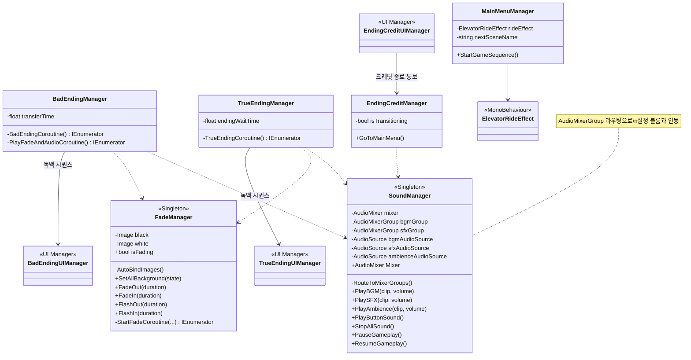

### 성능 계측

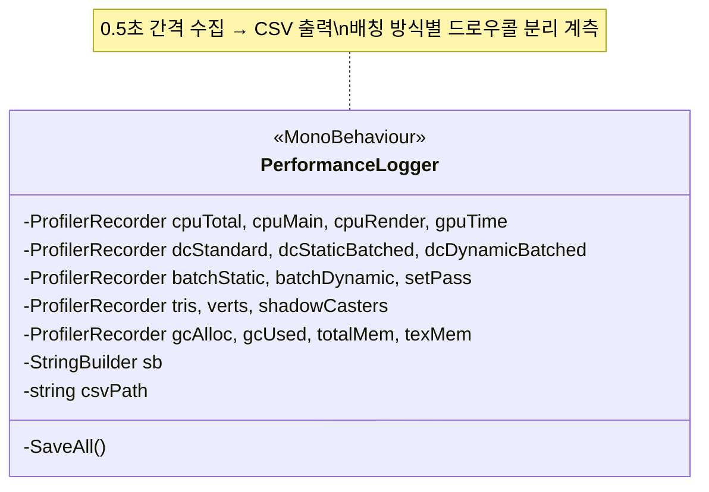

---

## 9. 이벤트 흐름 (정적 이벤트)

시스템을 분리한 만큼, **직접 참조 대신 정적 이벤트**로 연결됩니다. 발행자는 구독자의 존재를 알지 못합니다.

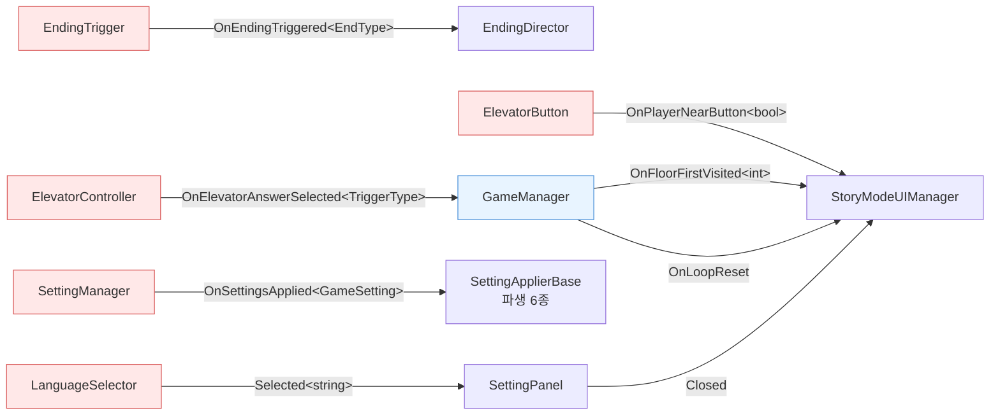

---

## 📋 설계 요약

| 계층 | 핵심 클래스 | 설계 의도 |
|---|---|---|
| **Game Core** | `GameManager` + `FloorProgress` · `FloorRule` · `MapSpawner` · `EndingDirector` | God-class를 **순수 로직(POCO/static)** 과 **Unity 협력자**로 분리 → 단일 책임 & 단위 테스트 가능 |
| **Anomaly** | `AbnormalData` + 구체 클래스 6종 | 추상 클래스 상속으로 이상현상 확장 시 기존 코드 수정 불필요(OCP) |
| **Settings** | `SettingManager` → `SettingApplierBase` 파생 6종 | `OnSettingsApplied` 브로드캐스트(Observer)로 각 시스템이 독립 구독 |
| **Localization** | `Loc` · `GameLanguages` | 정적 파사드 + 폴백 체인으로 번역 누락에도 안전 |
| **UI** | `BaseUIManager<T>` / `BaseEndingUIManager<T>` | 싱글톤·자동 바인딩·초기화 공통 로직을 제네릭 기반 클래스로 통일 |
| **공통 유틸** | `UIBinder`(Stack DFS) · `AnimatorParams` | 반복 로직을 정적 유틸로 추출해 중복 제거 |
| **Profiling** | `PerformanceLogger` | `ProfilerRecorder`로 드로우콜·삼각형·GC를 CSV 계측(정량 지표 근거) |
